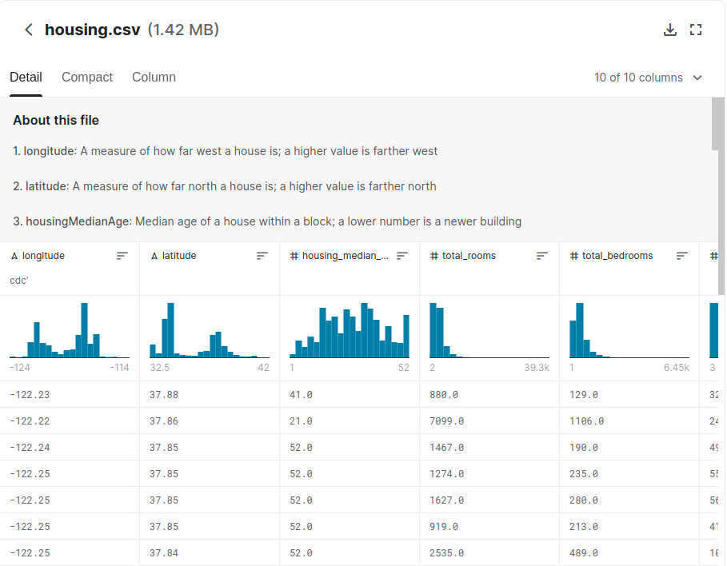

# California-Housing-Price-Prediction

In this project we try to find the best machine learning algorithm to predict California housing price  

## Dataset
You can download the housing dataset from this respo or you can also download it from kaggle website
[here](https://www.kaggle.com/camnugent/california-housing-prices)

## Model 
to use the saved model you just type : 

import pickle
model = pickle.load(open(filename , 'rb'))

and then you can make your prediction using model exemple: 
model.predict(x_test) or 
model.predict([[0.0,0.0, 0.0, 1.0 ,0.0 ,-122.23 ,37.88, 41 ,880, 129.0, 322 ,126, 8.3252]])
